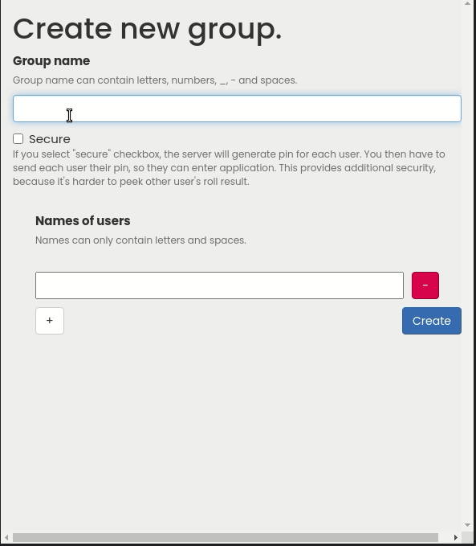
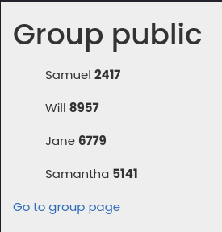
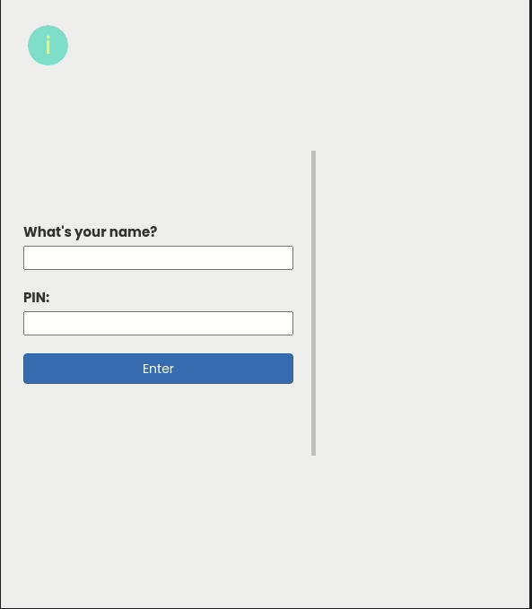

# Santa2020

This application allows you to create group, and then let each member draw other member. Why? For christmas 
gifting. Hence the name.

You can try it here: [santa2020](https://santa2020.herokuapp.com/) (it's hosted on heroku so first visit might take a while to load).

It's very minimalistic, there are 3 screens. 
When you enter the applictaion, you see screen responsible for creating group. 
There, you specify usernames, and optionally provide keys (increasing security).




After that, you are redirected to the overview screen, where you see all member,
and they keys (if you enabled secure mode). You will also get there a link, that you
should send to group members. 



Upon this link you will see prompt, asking your name 
(and optionally your key), after providing those you will be able to click "draw" button,
and see who you drafted.



### Installing 
If you are using linux (bash), you can clone repository, and
```
./create_env.sh
```
or 
```
bash create_env.sh
```
This will create python virtual environment, and install dependencies from *requirements.txt* file.

You can do this manually, by creating environment in *app/venv* folder:
```
python3 -m venv app/venv
```
then activating venv:
```
source app/venv/bin/activate
```
then installing pip modules:
```
pip install -r requirements.txt
```
Now you are ready to launch app:
```
export FLASK_APP=santa.py
flask run
```

### Tech stack
In process of development of this app (which was very short btw), I used following technologies:
- python3 with Flask
- SQLAlchemy with PostgreSQL (and Sqlite3 in development)
- HTML (jinja2 was used to handle SSR)
- CSS (with Bootstrap)
- Javascript (vanilla)

### Got any ideas? Submit new issue.
